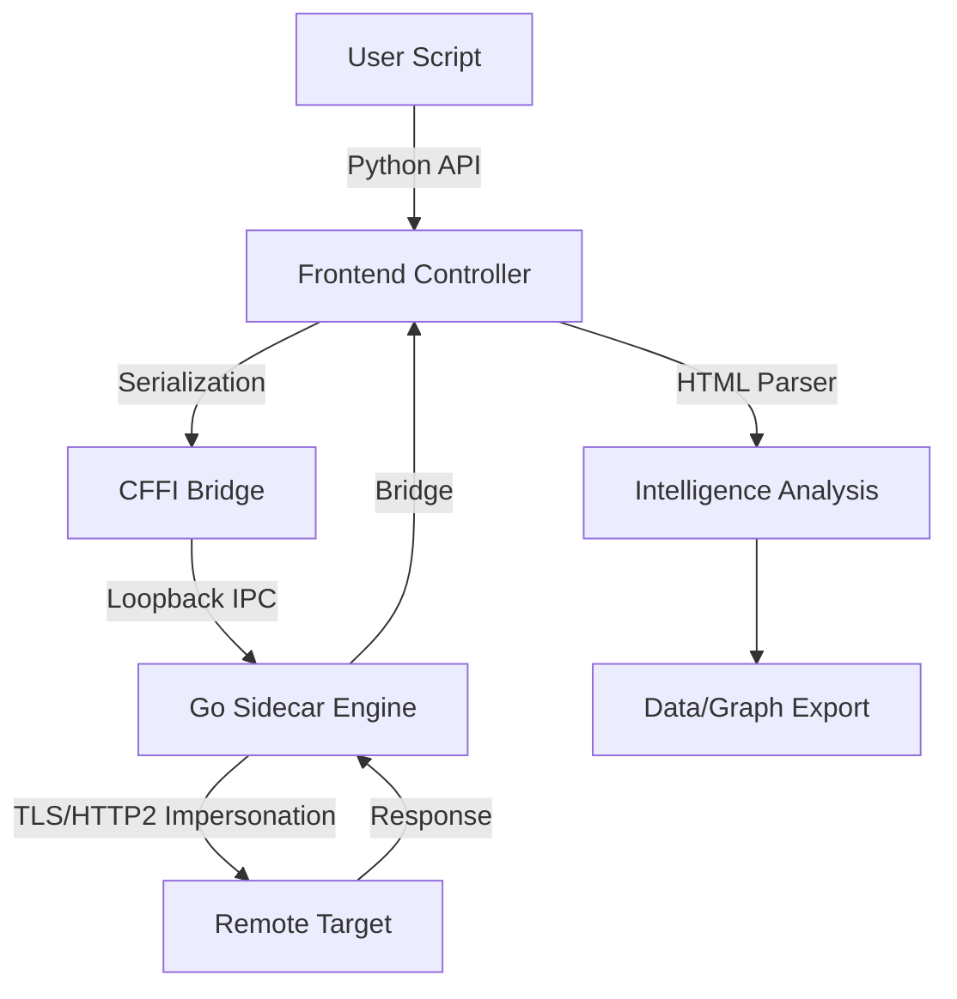
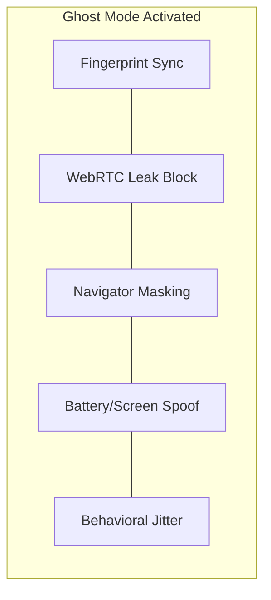

</img>

> [!CAUTION]
> **LEGAL DISCLAIMER**: LordRequests is intended for **legitimate research, security auditing, and educational purposes only**. The author (lordradeez.exe) is not responsible for any misuse, illegal activity, or damage caused by this tool. Users are strictly required to comply with all applicable local, national, and international laws, as well as the terms of service of any targeted platforms.


<h2 align="center">LordRequests (v0.9.2)</h2>

<h4 align="center">
<p align="center">
    <a href="https://github.com/lordradez23/LordRequests-v0.9.2-/blob/main/LICENSE">
        
    </a>
    <a href="https://python.org/">
        
    </a>
    <a href="https://github.com/lordradez23/LordRequests-v0.9.2-/releases">
        
    </a>
    <a href="https://github.com/ambv/black">
        
    </a>
</p>
    LordRequests (LR) is a professional-grade, high-performance stealth networking library designed to bypass the world's most sophisticated bot detection systems. By merging a Pythonic interface with a power-optimized Go-based sidecar, LordRequests delivers "Layer 7 Invisibility" through advanced TLS impersonation, cross-browser fingerprinting, and behavioral heuristics.
</h4>

---

# 🏗️ System Architecture

LordRequests utilizes a **Hybrid Sidecar Architecture** to bridge the gap between Python's developer velocity and Go's networking precision.

### High-Level Request Flow



### Technical Stack Breakdown

| Component | Responsibility | Technology |
| :--- | :--- | :--- |
| **Orchestration** | Session state, behavior jitter, identity vault | Python 3.10+ |
| **Network Core** | TLS mimicry, JA3/HTTP2 frames, Brotli/Gzip | sidecar-cgo (Go) |
| **Bridge** | C-level shared loading, IPC | CFFI / Localhost |
| **Browser Engine** | Full JS execution, DOM interaction, automation | Camoufox / Patchright |
| **Intelligence** | Subdomain discovery, WAF tuning, Sentiment analysis | Rule-based Heuristics |
| **Persistence** | Secure identity storage, Encrypted logs | AES-256 (Fernet) |

---

# 👻 The "Ghost" Mode Protocol

Introduced in v0.9.2, the **Ghost Mode Protocol** is a single master switch that enables every layer of protection LordRequests offers. It is designed for high-stakes environments where detection is not an option.



### Protections Included:
- **Unified Fingerprinter**: Synchronized Canvas, WebGL, and Audio noise.
- **WebRTC Shield**: Automated device enumeration masking and SDP IP filtering.
- **Navigator Hider**: Complete removal of `webdriver`, `automation`, and `selenium` signals.
- **Timezone/Locale Sync**: Automatic browser metadata alignment based on proxy IP.

---

# 🛠️ Feature Matrix

LordRequests is organized into three specialized suites, providing over **110 professional features**.

### 🟢 Core Identity & Stealth
- **TLS Impersonation**: Perfect JA3 and HTTP/2 settings frame replication.
- **Camoufox Integration**: Professional anti-detect browser automation.
- **Legendary Profiles**: Pre-compiled, high-trust browser fingerprints.
- **GeoSync**: Proxy-aware timezone and locale adjustment.
- **Battery & Screen Sync**: Hardware-level behavioral consistency.

### 🔵 LordIntelligence Suite
- **Subdomain Enumeration**: Passive (CRT logs) and Active enumeration.
- **WAF Tuner**: Specialized presets for Cloudflare, Akamai, and Datadome bypass.
- **Semantic Search**: Functional DOM identification (e.g., `find_semantic('login')`).
- **Deep-Web Health**: Specialized monitoring for .onion and .i2p services.
- **API Fuzzer**: Integrated endpoint discovery and boundary testing.
- **Graph Export**: RDF/GraphML output for Neo4j and analytical ingestion.

### 🟣 LordOperations Suite
- **Cluster Mode V2**: Distributed Leader-Follower sync with heartbeat monitoring.
- **SSH Tunneling**: Native SSH-based proxying directly in the session.
- **Traffic Throttling**: Connection simulation (Dial-up, LTE, Fiber profiles).
- **Web Dashboard**: Local Flask-based monitoring of all scraper activities.
- **Compliance Reporter**: Automated robots.txt and ToS audit summaries.
- **Self-Healing Sessions**: Automatic detection and recovery of stale connections.

---

# 🚀 Installation

Install the full suite with all headless browsing and anti-detect dependencies:

```bash
pip install -U hrequests[all]
python -m hrequests install
```

---

# 📖 Quick Start

### Basic Stealth Request
```python
import hrequests

# TLS fingerprints are automatically impersonated
resp = hrequests.get('https://www.example.com')
print(f"Status: {resp.status_code} | Reason: {resp.reason}")
```

### Engaging Ghost Mode
```python
import hrequests

# Initialize a browser session
with hrequests.BrowserSession(headless=True) as session:
    # Activate all stealth modules at once
    session.enable_ghost_mode() # Feature 110
    
    session.goto('https://whatisyourauto.com')
    print(session.html.find('#result').text)
```

### Semantic Automation
```python
# No more fragile CSS selectors
login_btn = resp.html.find_semantic('login')
login_btn.click()
```

---

# ⚖️ Ethical Use Policy

By using LordRequests, you agree to the following terms:
1. **Lawful Intent**: No unauthorized data collection or cyberattacks.
2. **Respect for Privacy**: Adherence to individual and organizational privacy policies.
3. **Open Source Spirit**: Contributions back to the core stealth engine are encouraged.

---

<p align="center">
  <b>Built for the Elite. Sustained by the Community.</b><br>
  Created by lordradeez.exe
</p>
